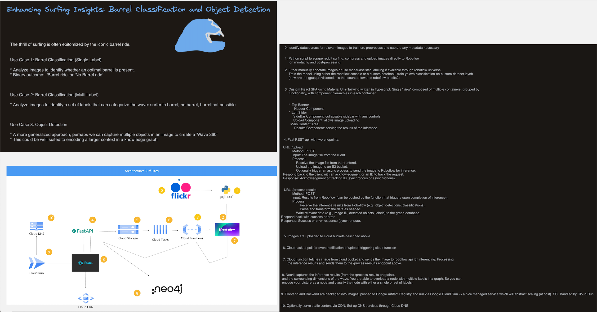

# Project Name

This project focuses on image analysis and classification using Neo4j and Roboflow.

## Use Cases Overview

## Project Overview

## Getting Started

Follow these steps to set up and run the project:

1. Clone the repository.
2. Install dependencies.
3. Run the application.

## Usage

Describe how to use the project or any relevant information for users.

## License

This project is licensed under the [License Name](link).
